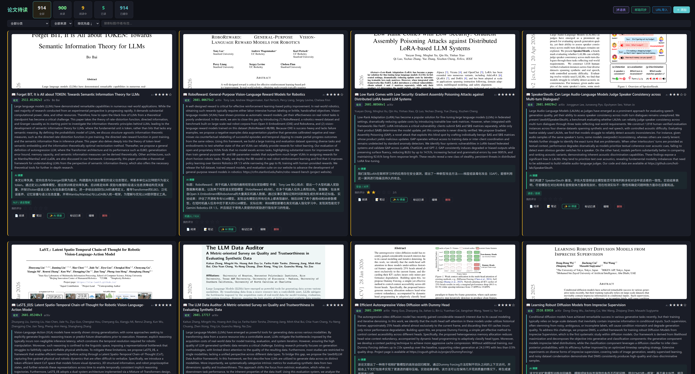

# Paper Reading WebUI

A self-hosted web app for organizing and reading academic papers. Instead of drowning in endless email alerts from Google Scholar, arXiv, newsletters, and other sources, this tool helps you centralize, categorize, and track your reading progress — with AI-powered summaries along the way.

> This project is developed with AI assistance (LLM) to help with implementation. (Opencode and Qwen-code)

## What it does

- **Centralize paper sources**: Import papers from arXiv URLs, email alerts, newsletters, or any URL
- **Automatic email scanning**: Periodically fetch your email inbox, extract paper links, and queue them for processing
- **Background processing**: Automatically download PDFs, extract layout, and generate AI summaries
- **Track reading progress**: Filter by status (Unread, Reading, Done) and category
- **AI-powered summaries**: Uses LLM to generate summaries and categorize papers into standard categories

## Demo



## Features

- **Import papers** from arXiv URLs, email alerts, newsletters, or any URL
- **Automatic email scanning** at scheduled times
- **Track reading progress** with status filters (Unread, Reading, Done)
- **AI-powered summaries** with category classification
- **Hover preview** of the first page
- **Local storage persistence** for filter states
- **Background worker** for automatic caching and processing

## Tech Stack

- **Backend**: Node.js + Express + better-sqlite3
- **Frontend**: Vanilla JS (no framework)
- **ML**: ONNX Runtime for layout detection
- **PDF Processing**: pdf.js, pdftoppm
- **AI**: LLM API (OpenAI-compatible) for summaries and categorization

## Installation

```bash
npm install
cp config.template.js config.js
# Edit config.js with your settings
npm start
```

Open http://localhost:3000 in your browser.

## Configuration

Copy `config.template.js` to `config.js` and customize:

| Setting | Description |
|---------|-------------|
| `PORT` | Server port (default: 3000) |
| `DB_PATH` | SQLite database path |
| `LLM.*` | LLM API base URL, key, model |
| `AI_CATEGORIES` | Standard paper categories |
| `BG_WORKER.*` | Background worker settings |
| `CACHE.DIR` | Cache directory for downloaded content |
| `LAYOUT_ANALYSIS.*` | Layout detection model settings |

See `config.template.js` for all available options.

## Email Sync (Optional)

Automatically scan your email inbox for paper alerts and import them.

How it works:
- Connects to your email via IMAP at a scheduled time (default: 8:00 UTC)
- Scans the configured folder for new emails
- Filters by sender (e.g., Google Scholar, arXiv, newsletters)
- Extracts paper URLs (arXiv, PDF links) from email content
- Imports papers automatically into your reading list
- Triggers background processing (metadata, PDF download, AI summary)

Configure in `config.js`:
```javascript
EMAIL_SYNC: {
  ENABLED: true,
  IMAP: { HOST, PORT, USER, PASSWORD },
  FOLDER: 'INBOX/GoogleScholar',
  SENDER: 'scholaralerts-noreply@google.com',
  CHECK_DAYS: 30,    // Look back this many days
  MAX_EMAILS: 64,   // Max emails to process per sync
}
```

## API Endpoints

- `GET /api/papers` - List papers with filters
- `POST /api/papers/import-url` - Import paper from URL
- `GET /api/papers/:id` - Get paper details
- `PUT /api/papers/:id` - Update paper
- `GET /api/stats` - Get statistics
- `POST /api/bg/*` - Background worker APIs

## License

MIT